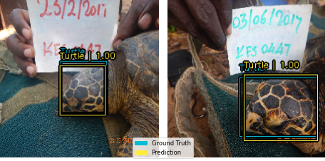

# Sea turtle Head Detection

    

Artificial Intelligence has seen a huge development over the years. Thanks to this potential, it is of the uttermost importance to use AI for the well-being of humans and of the world they are living in.
The 2030 Agenda for Sustainable Development, adopted by all United Nations Member States in 2015, provides a shared blueprint for peace and prosperity for people and the planet, now and into the future. At its heart are the 17 Sustainable Development Goals (SDGs), which are an urgent call for action by all countries - developed and developing - in a global partnership. 

    

Among these goals, n.14, "Life Under Water", got my attention and that is why I decided to implement an object detection model that is able to localize in an image turtles' heads. 
I used RetinaNet for the Object detection task and the results were quite promising: 87% IoU score.

    

In this repo you can find the report of my research along with the notebooks I used:
- [Report](AI_report.pdf) (read first): The report contains an explanation of the problem, why it is important for humanity and the Earth, and technically the approaches that were used for predicting the bounding boxes.
- [Regression with RetinaNet](https://github.com/AlbertoFormaggio1/turtle-head-detection/blob/main/sea_turtle_keras_cv.ipynb): in this notebook I used RetinaNet along with several backbones in order to find the best setting for finding turtles' heads in an image.
- [Naive Regression](sea_turtle_regression.ipynb): in this notebook instead I just used some backbones followed by regression layers to predict the 4 corners of the bounding box directly.

    

